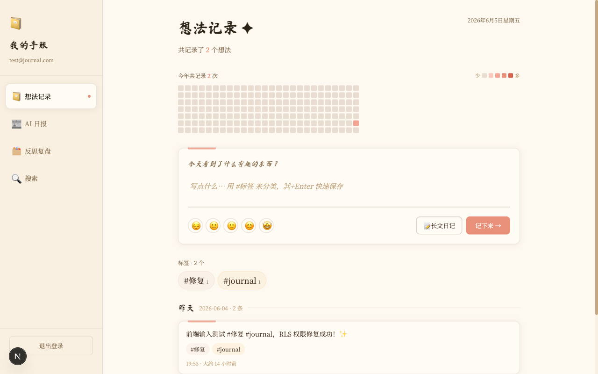
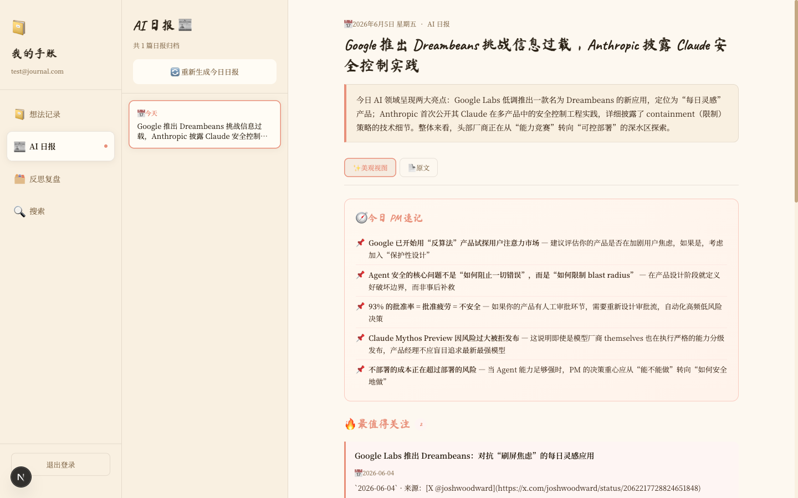
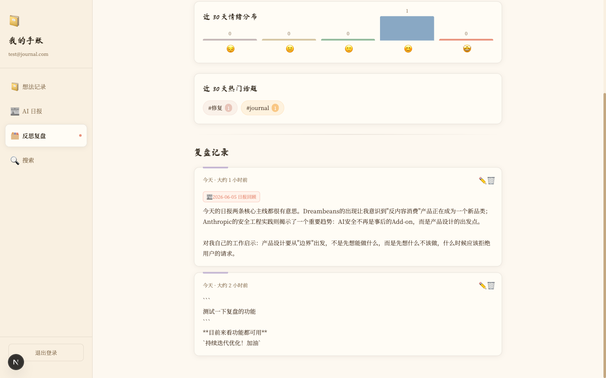
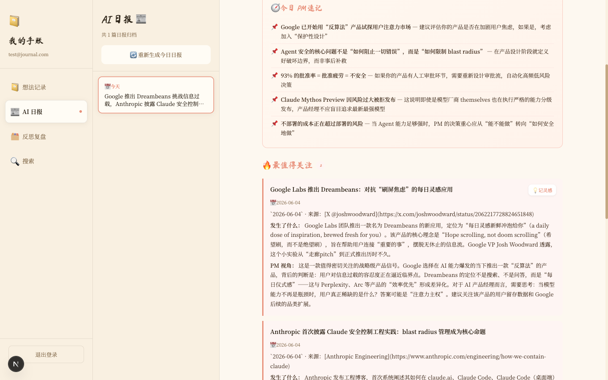
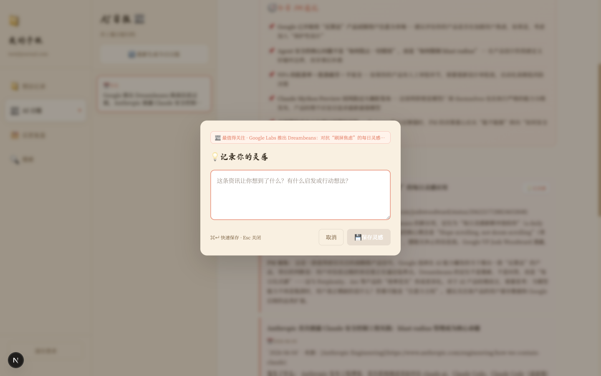
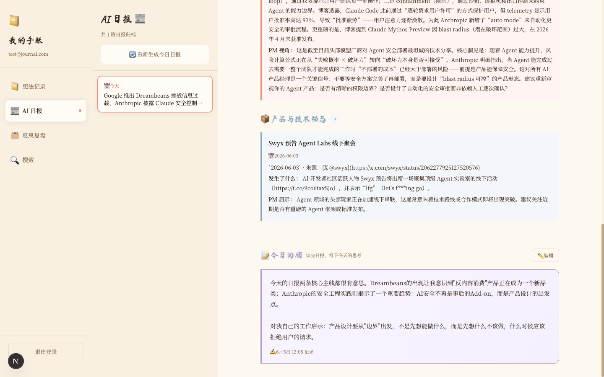

# 📔 我的手账 · My Journal

> 一个温暖纸质感/手账风格的个人日记 + AI 日报一键生成网站，支持阅读日报时随手记录灵感、写今日回顾，将信息真正内化为个人认知

**🌐 线上地址：[https://my-journal-orcin-two.vercel.app](https://my-journal-orcin-two.vercel.app)**

---

## 📸 界面预览

| 想法记录 | AI 日报 | 反思复盘 |
|:---:|:---:|:---:|
|  |  |  |
| 快速记录想法，热力图追踪活跃度 | 一键抓取多源 AI 资讯，AI 提炼生成日报 | 日报来源标签，溯源清晰 |

| 💡 记录灵感 | 灵感捕捉浮层 | 今日回顾 |
|:---:|:---:|:---:|
|  |  |  |
| 悬停资讯卡片，随手记灵感 | 预填来源上下文，⌘↵ 快速保存 | 读完日报写下今日思考，与日报绑定归档 |

---

## ✨ 功能概览

| 功能 | 说明 |
|------|------|
| 📝 **想法记录** | 快速记录日常想法，支持 `#标签` 自动分类，近半年热力图展示活跃度 |
| 📄 **记录详情页** | 完整查看任意一条记录，支持 Markdown 渲染、编辑、删除（删除前二次确认） |
| 📰 **AI 日报一键生成** | 网站内直接触发，自动抓取头部优质信息源，基于 AI 流式实时预览生成过程，完成后自动存档 |
| 💡 **灵感捕捉** | 阅读日报时悬停资讯卡片，一键唤出灵感浮层；自动预填来源上下文，⌘↵ 快速保存为碎片想法 |
| 📝 **今日回顾** | 日报底部专属回顾区域；读完写下今日思考，与当日日报绑定归档，在反思复盘页显示日报来源标签 |
| 🗂️ **反思复盘** | 长文日记入口，支持 Markdown 编辑，统计情绪分布与高频话题 |
| 🔍 **多维搜索** | 支持按正文内容、标签名、记录类型、时间范围（近 7/30 天、自定义）多维筛选检索 |
| 🏷️ **标签系统** | `#标签` 自动提取，标签计数精准维护（创建/编辑/删除均同步更新） |
| 🔒 **个人专属** | 登录后每位用户只能看到自己的数据（Supabase RLS 行级安全保护） |
| 📱 **移动端适配** | 移动端自动切换为顶部导航栏 + 抽屉菜单，内容区域不溢出不遮挡 |

---

## 🏗️ 技术架构

```
┌─────────────────────────────────────────────────────┐
│                    用户浏览器                         │
└─────────────────┬───────────────────────────────────┘
                  │ HTTPS
┌─────────────────▼───────────────────────────────────┐
│              Vercel（部署平台）                        │
│  ┌─────────────────────────────────────────────┐    │
│  │            Next.js 16（App Router）           │    │
│  │  ┌──────────────┐  ┌────────────────────┐   │    │
│  │  │  页面（SSR）  │  │  API Routes        │   │    │
│  │  │  - 想法记录   │  │  /api/notes        │   │    │
│  │  │  - AI 日报   │  │  /api/generate-brief│   │    │
│  │  │  - 反思复盘   │  │  /api/briefs        │   │    │
│  │  │  - 全文搜索   │  │  /api/search       │   │    │
│  │  └──────────────┘  └────────────────────┘   │    │
│  └─────────────────────────────────────────────┘    │
└──────────┬──────────────────────┬───────────────────┘
           │ Supabase SDK          │ OpenAI 兼容 API
┌──────────▼──────────┐  ┌────────▼────────────────┐
│   Supabase（后端）   │  │  BobDong / OpenAI 兼容  │
│  Auth / PostgreSQL  │  │  MiniMax / Claude / GPT  │
│  Row Level Security │  │  （AI 日报提炼生成）      │
└─────────────────────┘  └─────────────────────────┘
```

**技术栈：**
- **前端框架**：[Next.js 16](https://nextjs.org)（App Router + React 19）
- **样式**：[Tailwind CSS v4](https://tailwindcss.com) + Framer Motion
- **数据库 & 认证**：[Supabase](https://supabase.com)（PostgreSQL + Auth + RLS）
- **AI 接口**：OpenAI 兼容格式（支持 BobDong/BobAPI/DeepSeek/Claude 等）
- **部署**：[Vercel](https://vercel.com)（与 GitHub 自动同步部署）
- **语言**：TypeScript

---

## 📁 项目结构

```
my-journal/
├── src/
│   ├── app/
│   │   ├── (auth)/          # 登录/注册页面
│   │   │   ├── login/
│   │   │   └── register/
│   │   ├── (main)/          # 主功能页面（需登录）
│   │   │   ├── page.tsx         # 首页：想法记录
│   │   │   ├── notes/[id]/      # 记录详情页
│   │   │   ├── daily-brief/     # AI 日报
│   │   │   ├── reflection/      # 反思复盘
│   │   │   └── search/          # 多维搜索
│   │   └── api/             # 后端接口
│   │       ├── notes/           # 笔记 CRUD
│   │       ├── generate-brief/  # AI 日报生成（SSE 流式）
│   │       ├── briefs/          # 日报查询接口
│   │       ├── sync-brief/      # 日报手动同步
│   │       ├── search/          # 搜索接口
│   │       └── tags/            # 标签接口
│   ├── components/
│   │   ├── layout/          # 布局组件（Sidebar、MainContent 响应式）
│   │   ├── notes/           # 首页组件（HomeClient、NoteCard、Heatmap、TagCloud）
│   │   ├── editor/          # Markdown 编辑器（NoteEditor）
│   │   ├── brief/           # AI 日报组件
│   │   ├── reflection/      # 复盘组件
│   │   └── ui/              # 通用 UI
│   ├── lib/                 # 工具库（Supabase 客户端等）
│   └── types/               # TypeScript 类型定义
├── public/
│   └── screenshots/         # 界面截图
├── supabase-schema.sql      # 数据库建表脚本
├── CHANGELOG.md             # 版本变更记录
└── .env.local.example       # 环境变量配置模板
```

---

## 🚀 本地运行

**前置条件**：Node.js 18+，已有 Supabase 项目，已有 OpenAI 兼容 API Key

**1. 克隆并安装依赖**

```bash
git clone https://github.com/2038279302-code/my-journal.git
cd my-journal
npm install
```

**2. 配置环境变量**

```bash
cp .env.local.example .env.local
```

编辑 `.env.local`，填入配置：

```env
# Supabase（必填）
NEXT_PUBLIC_SUPABASE_URL=https://你的项目ID.supabase.co
NEXT_PUBLIC_SUPABASE_ANON_KEY=你的匿名密钥

# AI 日报生成（必填，支持 OpenAI 兼容接口）
AI_API_KEY=sk-你的Key
AI_API_BASE_URL=https://bobdong.cn/v1   # 或 https://api.openai.com/v1 等
AI_MODEL=MiniMax-M2.5                   # 或 gpt-4o / claude-sonnet-4-5 等
```

**3. 初始化数据库**

在 Supabase Dashboard → SQL Editor 中执行 `supabase-schema.sql` 建表脚本。

**4. 启动开发服务器**

```bash
npm run dev
```

访问 [http://localhost:3000](http://localhost:3000)

---

## 🔄 部署到 Vercel

本项目已配置 GitHub → Vercel 自动部署：

```bash
# 每次修改后，推送即自动触发 Vercel 重新部署（约 40 秒）
git add .
git commit -m "描述本次修改"
git push origin main
```

在 Vercel 项目设置 → Environment Variables 中添加以下变量（和 `.env.local` 一致）：
- `NEXT_PUBLIC_SUPABASE_URL`
- `NEXT_PUBLIC_SUPABASE_ANON_KEY`
- `AI_API_KEY`
- `AI_API_BASE_URL`
- `AI_MODEL`

---

## 📋 变更记录

详见 [CHANGELOG.md](./CHANGELOG.md)
